# IoT Backend - Microservices Architecture

A production-ready IoT solution backend built with **Spring Boot 3.2.5** and **Spring Cloud 2023.0.1**, decomposed into independently deployable microservices with API Gateway, service discovery, MQTT real-time communication, and Kubernetes orchestration.

---

## Table of Contents

- [Architecture Overview](#architecture-overview)
- [High-Level Architecture Diagram](#high-level-architecture-diagram)
- [Service Communication Flow](#service-communication-flow)
- [Module Descriptions](#module-descriptions)
- [Gateway Routing & JWT Flow](#gateway-routing--jwt-flow)
- [Sequence Diagrams](#sequence-diagrams)
  - [User Registration](#1-user-registration)
  - [User Login](#2-user-login)
  - [Token Refresh](#3-token-refresh)
  - [Get Current User](#4-get-current-user)
  - [Create Device](#5-create-device)
  - [List Devices](#6-list-devices)
  - [MQTT Device Status Update](#7-mqtt-device-status-update)
  - [WebSocket Real-Time Notification](#8-websocket-real-time-notification)
  - [Get Weather Data](#9-get-weather-data)
- [Database Design](#database-design)
- [Project Structure](#project-structure)
- [Technology Stack](#technology-stack)
- [Getting Started](#getting-started)
  - [Prerequisites](#prerequisites)
  - [Local Development](#local-development)
  - [Docker Compose](#docker-compose)
  - [Kubernetes Deployment](#kubernetes-deployment)
- [API Reference](#api-reference)
- [Configuration](#configuration)
- [Design Decisions](#design-decisions)

---

## Architecture Overview

The system follows a **microservices architecture** with a single entry point (API Gateway) that the mobile app communicates with using one `BASE_URL`. The gateway handles JWT validation, request routing, and CORS — freeing downstream services from authentication concerns.

### Core Principles

| Principle | Implementation |
|-----------|---------------|
| **Single Entry Point** | API Gateway (:8080) — mobile app uses one BASE_URL |
| **Centralized Auth** | Gateway validates JWT, extracts userId, passes `X-User-Id` header downstream |
| **Database per Service** | `auth_db` (users, tokens) and `device_db` (devices, controls) |
| **Service Discovery** | Eureka Server — services register and discover each other dynamically |
| **Loose Coupling** | No cross-database foreign keys; services communicate via REST + headers |
| **Shared Code** | `common-lib` JAR — DTOs, exceptions, JacksonConfig, JwtTokenProvider |

---

## High-Level Architecture Diagram

```
                          ┌─────────────────────┐
                          │     Mobile App       │
                          │   (Single BASE_URL)  │
                          └──────────┬───────────┘
                                     │
                                     │ HTTPS
                                     ▼
                    ┌────────────────────────────────┐
                    │       API Gateway :8080         │
                    │    Spring Cloud Gateway         │
                    │                                │
                    │  ┌──────────────────────────┐  │
                    │  │  JwtAuthGatewayFilter     │  │
                    │  │  • Validate JWT token     │  │
                    │  │  • Extract userId         │  │
                    │  │  • Add X-User-Id header   │  │
                    │  └──────────────────────────┘  │
                    │  ┌──────────────────────────┐  │
                    │  │  CorsGlobalConfig         │  │
                    │  │  • Allow all origins       │  │
                    │  └──────────────────────────┘  │
                    │  ┌──────────────────────────┐  │
                    │  │  StripPrefix=1             │  │
                    │  │  /api/auth/** → /auth/**   │  │
                    │  └──────────────────────────┘  │
                    └───┬──────────┬────────────┬────┘
                        │          │            │
            ┌───────────┘          │            └───────────┐
            │                      │                        │
            ▼                      ▼                        ▼
  ┌──────────────────┐  ┌──────────────────┐    ┌──────────────────┐
  │ Auth Service      │  │ Device Service    │    │ Weather Service   │
  │ :8081             │  │ :8082             │    │ :8084             │
  │                   │  │                   │    │                   │
  │ • Register        │  │ • Device CRUD     │    │ • Weather proxy   │
  │ • Login           │  │ • MQTT subscribe  │    │ • OpenWeatherMap  │
  │ • Refresh token   │  │ • WebSocket push  │    │                   │
  │ • Get profile     │  │                   │    │   (No Database)   │
  └────────┬──────────┘  └──┬─────────┬─────┘    └───────────────────┘
           │                │         │
           ▼                ▼         │
    ┌────────────┐   ┌────────────┐   │         ┌──────────────────┐
    │  auth_db   │   │ device_db  │   │         │  Eureka Server   │
    │ PostgreSQL │   │ PostgreSQL │   │         │  :8761           │
    │            │   │            │   │         │                  │
    │ • users    │   │ • devices  │   │         │  All services    │
    │ • refresh_ │   │ • device_  │   │         │  register here   │
    │   tokens   │   │   controls │   │         └──────────────────┘
    └────────────┘   └────────────┘   │
                                      │
                              ┌───────┴────────┐
                              │  MQTT Broker    │
                              │ (HiveMQ Public) │
                              │                 │
                              │ devices/#       │
                              └────────────────┘
```

---

## Service Communication Flow

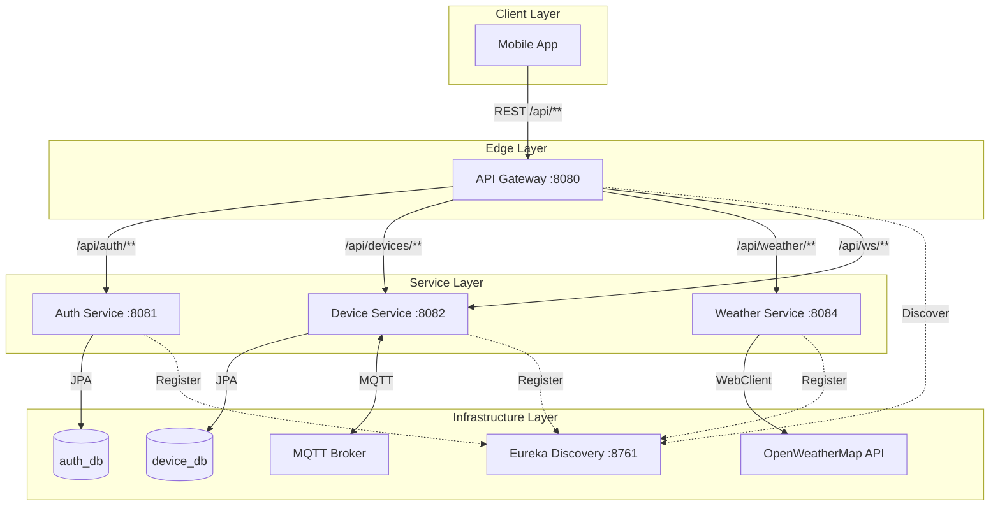

---

## Module Descriptions

### common-lib (Shared JAR)
Non-bootable shared library containing code reused across services.

| Package | Contents |
|---------|----------|
| `com.foodchain.common.config` | `JacksonConfig` — snake_case JSON serialization |
| `com.foodchain.common.security` | `JwtTokenProvider` — JWT generation & validation |
| `com.foodchain.common.dto.auth` | `LoginRequest`, `SignUpRequest`, `AuthResponse`, `UserDto` |
| `com.foodchain.common.dto.device` | `DeviceDto`, `DeviceLocationDto`, `DeviceControlDto`, `CreateDeviceRequest`, `UpdateDeviceRequest` |
| `com.foodchain.common.dto.mqtt` | `MqttMessageDto`, `ControlCommandDto` |
| `com.foodchain.common.exception` | `ResourceNotFoundException`, `BadRequestException`, `ErrorResponse`, `GlobalExceptionHandler` |

### discovery-server (:8761)
Netflix Eureka Server for service registration and discovery. All microservices register on startup and the API Gateway uses Eureka to resolve `lb://service-name` URIs.

### api-gateway (:8080)
Spring Cloud Gateway (reactive/Netty) — the single entry point for all client requests.

| Component | Responsibility |
|-----------|---------------|
| `JwtAuthGatewayFilter` | Validates Bearer token, extracts userId, adds `X-User-Id` header |
| `CorsGlobalConfig` | Reactive CORS — allows all origins, methods, headers |
| Route definitions | 5 routes with `StripPrefix=1` to remove `/api` prefix |

### auth-service (:8081)
Handles user registration, login, token refresh, and profile retrieval.

| Endpoint | Auth | Description |
|----------|------|-------------|
| `POST /auth/register` | Public | Create account, return JWT |
| `POST /auth/login` | Public | Authenticate, return JWT |
| `POST /auth/refresh` | JWT | Rotate tokens (uses X-User-Id) |
| `GET /auth/me` | JWT | Get current user profile |
| `GET /internal/users/{id}` | Internal | Service-to-service user lookup |

### device-service (:8082)
Manages IoT devices with MQTT real-time status updates and WebSocket push notifications.

| Endpoint | Auth | Description |
|----------|------|-------------|
| `GET /devices` | JWT | List user's devices |
| `GET /devices/{id}` | JWT | Get device details |
| `POST /devices` | JWT | Create new device |
| `PUT /devices/{id}` | JWT | Update device |
| `DELETE /devices/{id}` | JWT | Delete device |
| `WS /ws` | Public | STOMP WebSocket endpoint |

### weather-service (:8084)
Stateless proxy to OpenWeatherMap API. No database.

| Endpoint | Auth | Description |
|----------|------|-------------|
| `GET /weather?lat=&lon=&units=` | JWT | Get current weather |

---

## Gateway Routing & JWT Flow

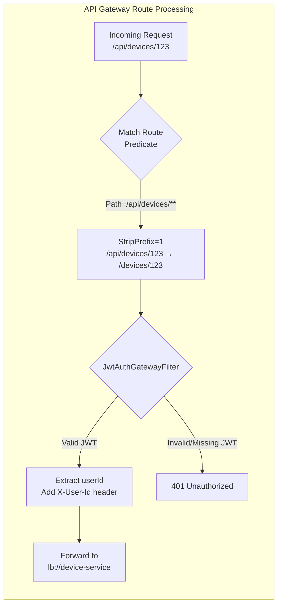

### Route Table

| Route ID | Path Predicate | Target Service | JWT Required | Strip Prefix |
|----------|---------------|----------------|:------------:|:------------:|
| `auth-public` | `/api/auth/login`, `/api/auth/register` | `lb://auth-service` | No | `/api` |
| `auth-private` | `/api/auth/**` | `lb://auth-service` | Yes | `/api` |
| `device-service` | `/api/devices/**` | `lb://device-service` | Yes | `/api` |
| `weather-service` | `/api/weather/**` | `lb://weather-service` | Yes | `/api` |
| `device-ws` | `/api/ws/**` | `lb://device-service` | No | `/api` |

### JWT Flow Detail

```
Mobile App                    API Gateway                   Downstream Service
    │                             │                              │
    │  Authorization: Bearer xxx  │                              │
    │────────────────────────────>│                              │
    │                             │                              │
    │                             │  1. Extract token from       │
    │                             │     Authorization header     │
    │                             │                              │
    │                             │  2. Validate JWT signature   │
    │                             │     & expiration             │
    │                             │                              │
    │                             │  3. Extract userId from      │
    │                             │     JWT subject claim        │
    │                             │                              │
    │                             │  X-User-Id: <userId>         │
    │                             │─────────────────────────────>│
    │                             │                              │
    │                             │  4. Service reads            │
    │                             │     @RequestHeader("X-User-Id")
    │                             │                              │
    │          Response           │          Response            │
    │<────────────────────────────│<─────────────────────────────│
```

---

## Sequence Diagrams

### 1. User Registration

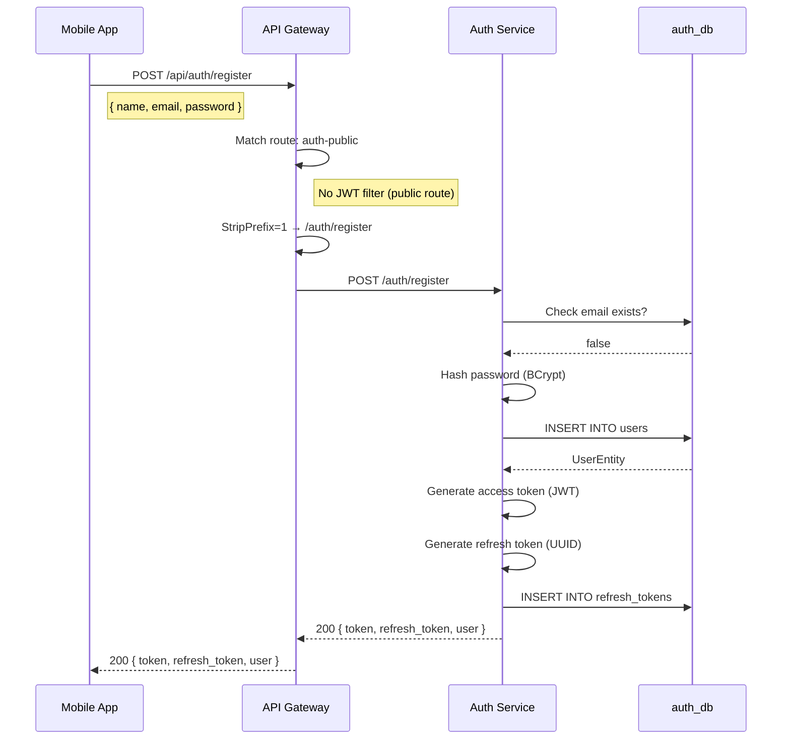

### 2. User Login

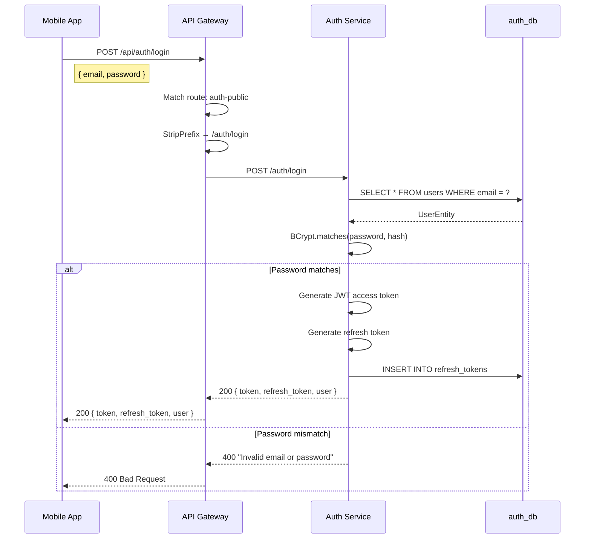

### 3. Token Refresh

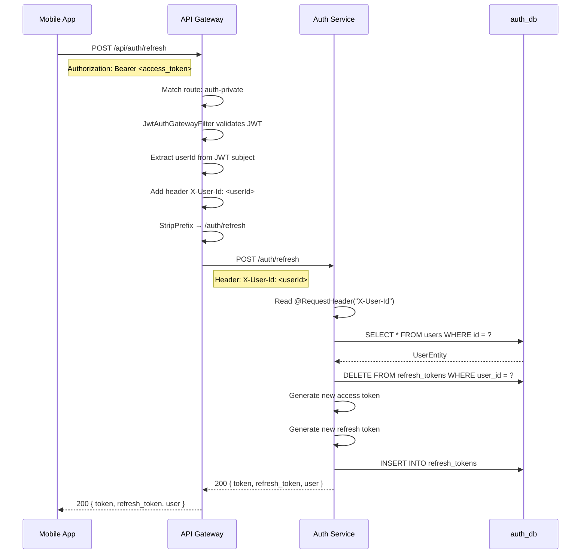

### 4. Get Current User

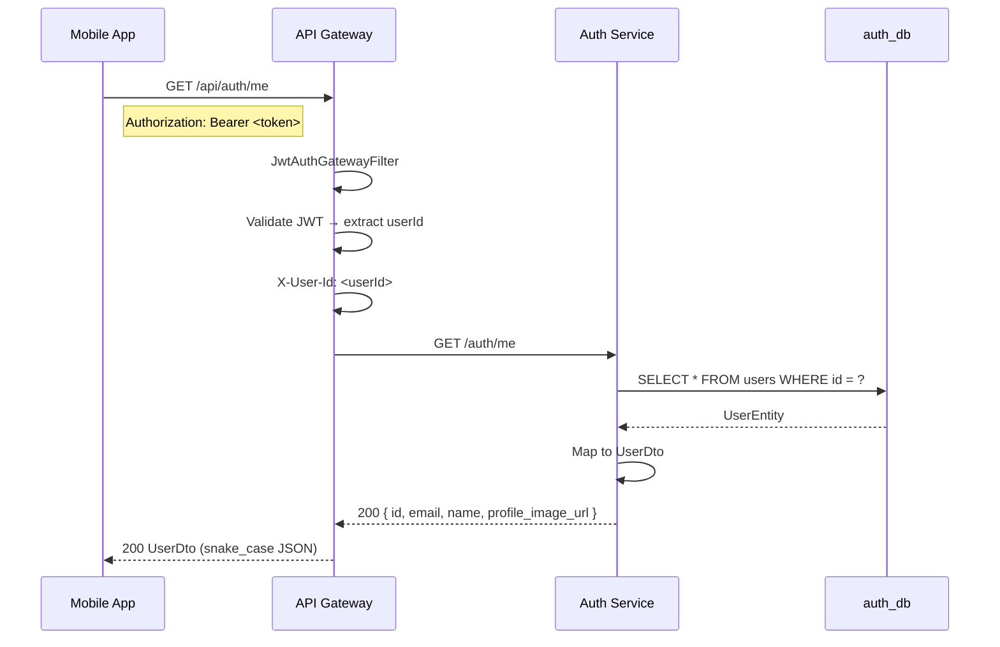

### 5. Create Device

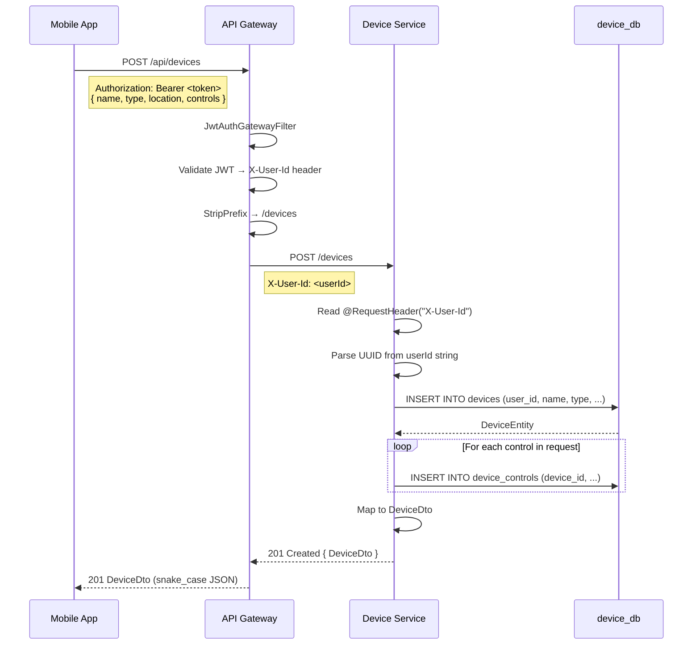

### 6. List Devices

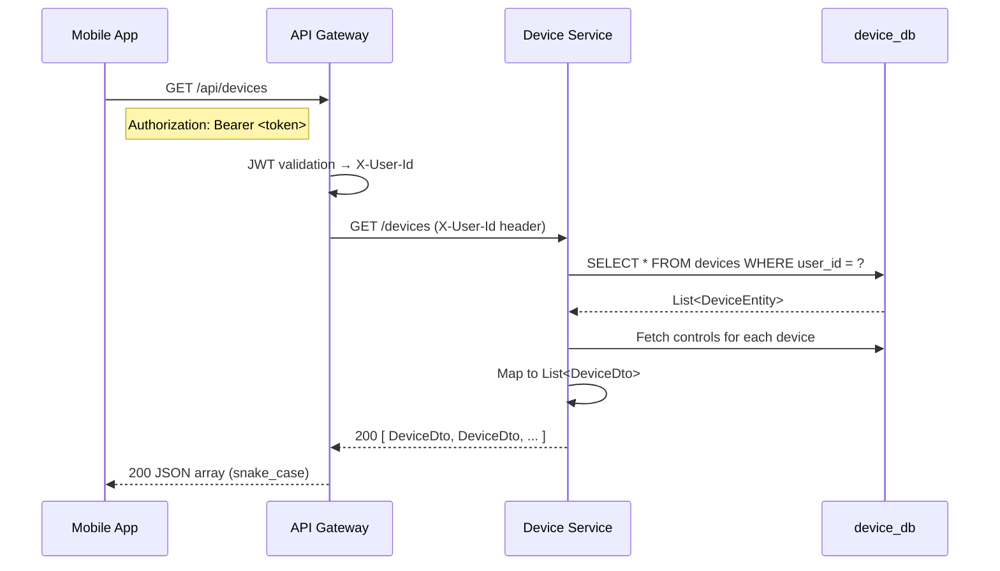

### 7. MQTT Device Status Update

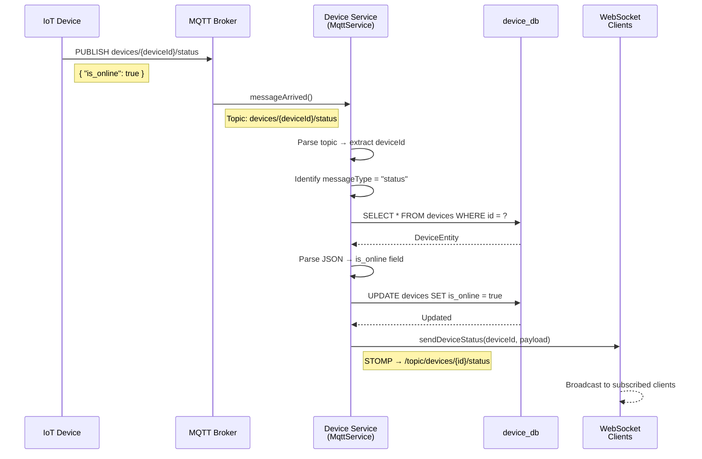

### 8. WebSocket Real-Time Notification

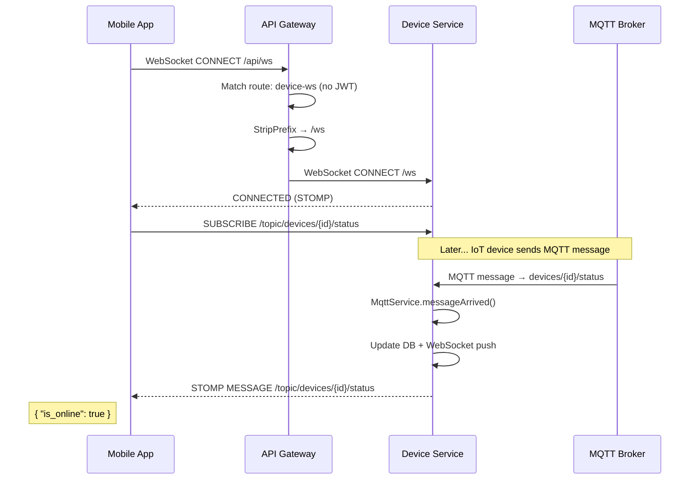

### 9. Get Weather Data

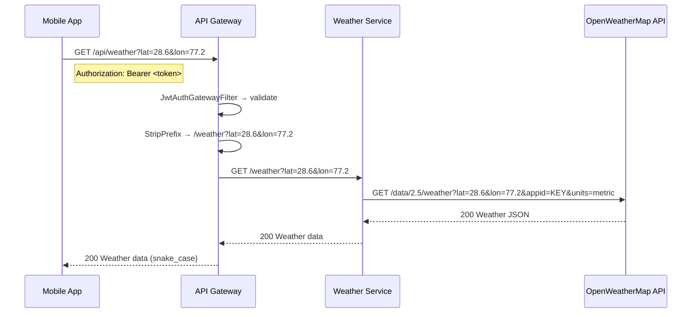

---

## Database Design

### auth_db (Auth Service)

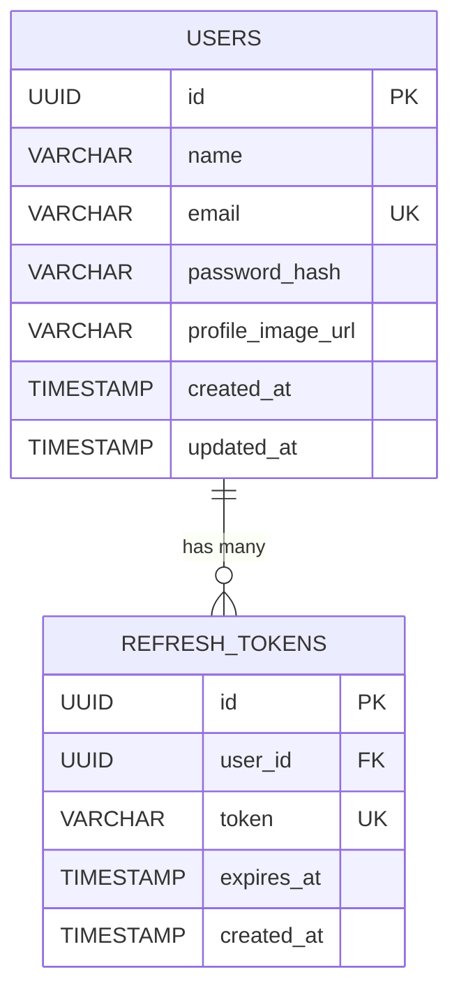

### device_db (Device Service)

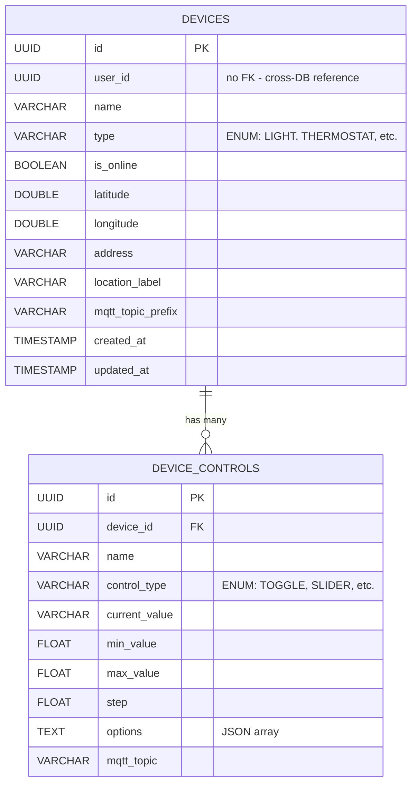

> **Note:** `DEVICES.user_id` is a plain UUID column, not a foreign key. Since `auth_db` and `device_db` are separate databases, cross-database foreign keys are not possible. The gateway ensures only valid, authenticated user IDs reach the device service.

---

## Project Structure

```
iot-backend/
├── pom.xml                              # Parent POM (packaging=pom, 6 modules)
├── docker-compose.yml                   # 2 Postgres + all services
├── .gitignore
├── README.md
│
├── common-lib/                          # Shared JAR (NOT a Spring Boot app)
│   ├── pom.xml
│   └── src/main/java/com/foodchain/common/
│       ├── config/JacksonConfig.java
│       ├── security/JwtTokenProvider.java
│       ├── dto/auth/{LoginRequest,SignUpRequest,AuthResponse,UserDto}.java
│       ├── dto/device/{DeviceDto,DeviceLocationDto,DeviceControlDto,
│       │               CreateDeviceRequest,UpdateDeviceRequest}.java
│       ├── dto/mqtt/{MqttMessageDto,ControlCommandDto}.java
│       └── exception/{ResourceNotFoundException,BadRequestException,
│                      ErrorResponse,GlobalExceptionHandler}.java
│
├── discovery-server/                    # Eureka Server :8761
│   ├── pom.xml
│   ├── Dockerfile
│   └── src/.../discovery/
│       ├── DiscoveryServerApplication.java
│       └── resources/application.yml
│
├── api-gateway/                         # Spring Cloud Gateway :8080
│   ├── pom.xml
│   ├── Dockerfile
│   └── src/.../gateway/
│       ├── ApiGatewayApplication.java
│       ├── config/CorsGlobalConfig.java
│       ├── filter/JwtAuthGatewayFilter.java
│       └── resources/application.yml
│
├── auth-service/                        # Authentication :8081
│   ├── pom.xml
│   ├── Dockerfile
│   └── src/.../auth/
│       ├── AuthServiceApplication.java
│       ├── config/SecurityConfig.java
│       ├── entity/{UserEntity,RefreshTokenEntity}.java
│       ├── repository/{UserRepository,RefreshTokenRepository}.java
│       ├── mapper/UserMapper.java
│       ├── service/AuthService.java
│       ├── controller/{AuthController,InternalUserController}.java
│       └── resources/application.yml
│
├── device-service/                      # Device Management :8082
│   ├── pom.xml
│   ├── Dockerfile
│   └── src/.../device/
│       ├── DeviceServiceApplication.java
│       ├── config/{SecurityConfig,MqttConfig,WebSocketConfig}.java
│       ├── entity/{DeviceEntity,DeviceControlEntity,DeviceType,
│       │           ControlType,StringListConverter}.java
│       ├── repository/{DeviceRepository,DeviceControlRepository}.java
│       ├── mapper/DeviceMapper.java
│       ├── service/{DeviceService,MqttService,WebSocketNotificationService}.java
│       ├── controller/DeviceController.java
│       └── resources/application.yml
│
├── weather-service/                     # Weather Proxy :8084
│   ├── pom.xml
│   ├── Dockerfile
│   └── src/.../weather/
│       ├── WeatherServiceApplication.java
│       ├── config/{SecurityConfig,WebClientConfig}.java
│       ├── service/WeatherService.java
│       ├── controller/WeatherController.java
│       └── resources/application.yml
│
└── k8s/                                 # Kubernetes manifests
    ├── namespace.yml
    ├── secrets.yml
    ├── postgres/{auth-db,device-db}-{statefulset,service}.yml
    ├── discovery-server/{deployment,service}.yml
    ├── api-gateway/{deployment,service,hpa,ingress}.yml
    ├── auth-service/{deployment,service,configmap,hpa}.yml
    ├── device-service/{deployment,service,configmap,hpa}.yml
    └── weather-service/{deployment,service,configmap,hpa}.yml
```

---

## Technology Stack

| Layer | Technology | Version |
|-------|-----------|---------|
| **Language** | Java | 17 |
| **Framework** | Spring Boot | 3.2.5 |
| **Cloud** | Spring Cloud | 2023.0.1 |
| **Gateway** | Spring Cloud Gateway (Netty) | — |
| **Discovery** | Netflix Eureka | — |
| **Security** | Spring Security + JWT (JJWT) | 0.12.5 |
| **ORM** | Spring Data JPA / Hibernate | — |
| **Database** | PostgreSQL | 16 |
| **MQTT** | Eclipse Paho Client | 1.2.5 |
| **WebSocket** | Spring WebSocket (STOMP/SockJS) | — |
| **HTTP Client** | Spring WebFlux WebClient | — |
| **Build** | Maven (multi-module) | — |
| **Containerization** | Docker | — |
| **Orchestration** | Kubernetes | — |

---

## Getting Started

### Prerequisites

- **Java 17** (JDK)
- **Maven 3.8+**
- **Docker & Docker Compose** (for containerized deployment)
- **PostgreSQL 16** (for local development without Docker)
- **kubectl** (for Kubernetes deployment)

### Local Development

1. **Start databases** (create two PostgreSQL databases):

```bash
# Option A: Use Docker for databases only
docker compose up auth-db device-db -d

# Option B: Create databases manually
createdb -U iot_user auth_db
createdb -U iot_user device_db
```

2. **Build the project**:

```bash
cd iot-backend
mvn clean install -DskipTests
```

3. **Start services** (in separate terminals, in this order):

```bash
# Terminal 1: Discovery Server
java -jar discovery-server/target/discovery-server-0.0.1-SNAPSHOT.jar

# Terminal 2: Auth Service
java -jar auth-service/target/auth-service-0.0.1-SNAPSHOT.jar

# Terminal 3: Device Service
java -jar device-service/target/device-service-0.0.1-SNAPSHOT.jar

# Terminal 4: Weather Service
java -jar weather-service/target/weather-service-0.0.1-SNAPSHOT.jar

# Terminal 5: API Gateway (start last, after services register with Eureka)
java -jar api-gateway/target/api-gateway-0.0.1-SNAPSHOT.jar
```

4. **Verify**: Open Eureka dashboard at `http://localhost:8761` — all 4 services should appear.

### Docker Compose

```bash
# Build and start everything
mvn clean install -DskipTests
docker compose up --build -d

# Check logs
docker compose logs -f

# Stop
docker compose down
```

**Services available at:**

| Service | URL |
|---------|-----|
| API Gateway | http://localhost:8080 |
| Eureka Dashboard | http://localhost:8761 |
| Auth Service (direct) | http://localhost:8081 |
| Device Service (direct) | http://localhost:8082 |
| Weather Service (direct) | http://localhost:8084 |

### Kubernetes Deployment

```bash
# 1. Build Docker images
docker build -t iot-backend/discovery-server:latest ./discovery-server
docker build -t iot-backend/api-gateway:latest ./api-gateway
docker build -t iot-backend/auth-service:latest ./auth-service
docker build -t iot-backend/device-service:latest ./device-service
docker build -t iot-backend/weather-service:latest ./weather-service

# 2. Apply Kubernetes manifests (in order)
kubectl apply -f k8s/namespace.yml
kubectl apply -f k8s/secrets.yml
kubectl apply -f k8s/postgres/
kubectl apply -f k8s/discovery-server/
kubectl apply -f k8s/auth-service/
kubectl apply -f k8s/device-service/
kubectl apply -f k8s/weather-service/
kubectl apply -f k8s/api-gateway/

# 3. Check status
kubectl get all -n iot-backend
```

---

## API Reference

All endpoints are accessed through the API Gateway at `http://localhost:8080`.
All JSON responses use **snake_case** naming convention.

### Authentication

```bash
# Register
curl -X POST http://localhost:8080/api/auth/register \
  -H "Content-Type: application/json" \
  -d '{"name": "John", "email": "john@example.com", "password": "secret123"}'

# Login
curl -X POST http://localhost:8080/api/auth/login \
  -H "Content-Type: application/json" \
  -d '{"email": "john@example.com", "password": "secret123"}'

# Refresh token
curl -X POST http://localhost:8080/api/auth/refresh \
  -H "Authorization: Bearer <access_token>"

# Get profile
curl http://localhost:8080/api/auth/me \
  -H "Authorization: Bearer <access_token>"
```

### Devices

```bash
# Create device
curl -X POST http://localhost:8080/api/devices \
  -H "Authorization: Bearer <token>" \
  -H "Content-Type: application/json" \
  -d '{
    "name": "Living Room Light",
    "type": "LIGHT",
    "location": {"latitude": 28.6, "longitude": 77.2, "address": "Home", "label": "Living Room"},
    "controls": [{"name": "Power", "control_type": "TOGGLE", "current_value": "false"}],
    "mqtt_topic_prefix": "home/living-room"
  }'

# List devices
curl http://localhost:8080/api/devices \
  -H "Authorization: Bearer <token>"

# Get device
curl http://localhost:8080/api/devices/{id} \
  -H "Authorization: Bearer <token>"

# Update device
curl -X PUT http://localhost:8080/api/devices/{id} \
  -H "Authorization: Bearer <token>" \
  -H "Content-Type: application/json" \
  -d '{"name": "Bedroom Light"}'

# Delete device
curl -X DELETE http://localhost:8080/api/devices/{id} \
  -H "Authorization: Bearer <token>"
```

### Weather

```bash
# Get weather
curl "http://localhost:8080/api/weather?lat=28.6139&lon=77.2090&units=metric" \
  -H "Authorization: Bearer <token>"
```

---

## Configuration

### Environment Variables

| Variable | Default | Used By | Description |
|----------|---------|---------|-------------|
| `JWT_SECRET` | `default-secret-key...` | Gateway, Auth | JWT signing key (min 256 bits) |
| `DB_HOST` | `localhost` | Auth, Device | PostgreSQL host |
| `DB_PORT` | `5432` | Auth, Device | PostgreSQL port |
| `DB_NAME` | `auth_db` / `device_db` | Auth, Device | Database name |
| `DB_USERNAME` | `iot_user` | Auth, Device | Database username |
| `DB_PASSWORD` | `iot_pass` | Auth, Device | Database password |
| `EUREKA_URI` | `http://localhost:8761/eureka/` | All | Eureka server URL |
| `MQTT_BROKER_URL` | `tcp://broker.hivemq.com:1883` | Device | MQTT broker URL |
| `MQTT_CLIENT_ID` | `iot-device-service` | Device | MQTT client identifier |
| `WEATHER_API_KEY` | _(empty)_ | Weather | OpenWeatherMap API key |
| `JPA_DDL_AUTO` | `update` | Auth, Device | Hibernate DDL strategy |

---

## Design Decisions

### Why Gateway-Level JWT Validation?
Each downstream service trusts the `X-User-Id` header set by the gateway. This eliminates the need for every service to have JWT dependencies, user repositories, and security filter chains. Services focus purely on business logic.

### Why Database-per-Service?
`auth_db` and `device_db` are separate PostgreSQL instances. This ensures services can be scaled, deployed, and maintained independently. The trade-off is no cross-database foreign keys — `DeviceEntity.userId` is a plain UUID column validated by the gateway's JWT filter.

### Why MQTT Stays in Device Service?
The `MqttService` directly reads and writes to `DeviceRepository` (updating `is_online` status). Extracting MQTT into its own service would require API calls back to device-service for every status update, adding latency and complexity for no clear benefit.

### Why StripPrefix=1?
The mobile app calls `/api/devices`, `/api/auth/login`, etc. The gateway strips the `/api` prefix so downstream controllers keep their existing `@RequestMapping("/devices")` and `@RequestMapping("/auth")` paths unchanged from the monolith.

### Why permitAll() in Downstream Security?
Since the gateway already validates JWT and the services are not directly exposed to clients (only through the gateway), downstream SecurityConfig uses `permitAll()`. In production with Kubernetes, network policies ensure only the gateway can reach service ports.

### Why snake_case JSON?
The mobile app (Flutter/React Native) conventionally uses snake_case. `JacksonConfig` in `common-lib` sets `PropertyNamingStrategies.SNAKE_CASE` globally, ensuring all responses are consistent across services.
